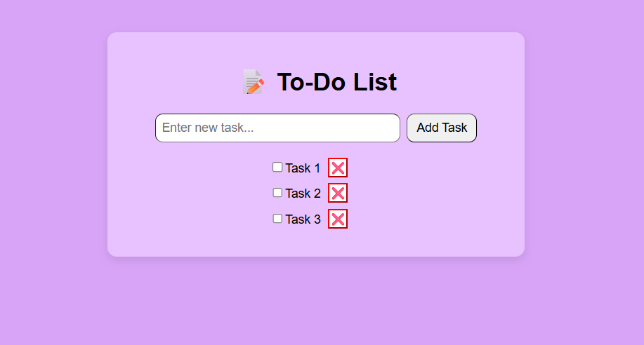

# 📝 React To-Do List

A simple, clean, and functional To-Do List built with **React + Vite** — created as part of my React learning journey.

This project helped me understand and practice key React concepts including state management, component communication, list rendering, and controlled form inputs.

---

## 🚀 Features

- Add new tasks  
- Mark tasks as complete / incomplete  
- Delete tasks  
- Controlled input field  
- State-driven rendering  
- Separated components (`App.jsx`, `TodoItem.jsx`)  
- Responsive and minimal UI

---

## 🎓 What I Learned

This app was built to explore and practice:

- React `useState` hook  
- Controlled components (`onChange` and `value` for inputs)  
- Updating lists in React using spread syntax  
- Immutable state updates with `.map()` and `.filter()`  
- Component-based architecture  
- Prop passing between parent and child components  
- Basic CSS styling in React apps  

---

## 🛠️ Tech Stack

- React (with Vite)  
- JavaScript (ES6+)  
- CSS

---

## 💻 Getting Started

To run this app locally:

```bash
# Clone the repo
git clone https://github.com/Zmy-Shaurya/React-Todo-List.git

# Install dependencies
npm install

# Start the dev server
npm run dev
```
---

🚧 Possible Improvements I might consider in the future:-

- Persist tasks using localStorage
- Add edit task feature
- Add filter (All / Active / Completed)
- Clear completed tasks
- Save creation date for each task
- Add priority level for tasks
- Dark mode
- Better animations and UI polish

---

📸 Screenshot:
